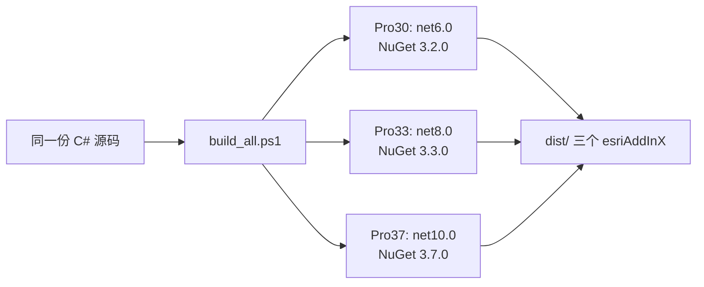

# GHBOX ArcGIS Pro AddIn 开发指南

> 本项目用纯 C# 开发 ArcGIS Pro 插件，`toolbox/` 下
> 保留各工具的原始 .pyt 作为业务逻辑基准，AddIn 运行不依赖它。

## 一、项目结构

```
GHBOX/
├── AddIn开发指南.md         # 本文档
├── addin/                   # C# AddIn 工程（发布形态，业务逻辑全在这里）
│   ├── GHBoxAddIn.csproj        # 项目文件（按 BuildFlavor 参数切换 Pro 版本）
│   ├── Config.daml              # 插件声明：选项卡/分组/按钮 注册
│   ├── Module1.cs               # 模块入口（单例，DAML 中的 GHBoxAddIn_Module）
│   ├── build_all.ps1            # 一键构建全部 Pro 版本的安装包
│   ├── dist/                    # 安装包产物（分发给别人双击即装）
│   │   ├── GHBoxAddIn_Pro30.esriAddInX   # Pro 3.0~3.2
│   │   ├── GHBoxAddIn_Pro33.esriAddInX   # Pro 3.3~3.6
│   │   └── GHBoxAddIn_Pro37.esriAddInX   # Pro 3.7+
│   ├── bin/Release/             # 编译输出
│   └── Scripts/
│       ├── GDB/                 # 数据库处理类工具
│       │   ├── Themes/GhBoxStyles.xaml # 全工具统一样式字典（Pro 原生风精修，明暗主题自适应）
│       │   ├── GpHelper.cs          # 公共辅助：GP执行/Exists/GetCount/打开GDB
│       │   ├── ShowLayerMerge.cs    # 按钮：数据库合并
│       │   ├── LayerMerge.xaml(.cs) # 窗口+业务逻辑
│       │   ├── MergeHelp.xaml(.cs)  # 数据库合并使用说明
│       │   ├── ShowDbSplit.cs       # 按钮：数据库拆分
│       │   ├── DbSplit.xaml(.cs)    # 窗口+业务逻辑
│       │   ├── DbSplitHelp.xaml(.cs)# 数据库拆分使用说明
│       │   ├── ShowUniqueCode.cs    # 按钮：唯一编码
│       │   ├── UniqueCode.xaml(.cs) # 窗口+业务逻辑（选库→多选图层→字段联动）
│       │   ├── UniqueCodeHelp.xaml(.cs)# 唯一编码使用说明
│       │   ├── ShowAreaCalc.cs      # 按钮：面积重算
│       │   ├── AreaCalc.xaml(.cs)   # 窗口+业务逻辑（椭球面积+五单位）
│       │   ├── AreaCalcHelp.xaml(.cs)# 面积重算使用说明
│       │   ├── ShowLayerDelete.cs   # 按钮：删除图层
│       │   ├── LayerDelete.xaml(.cs)# 窗口+业务逻辑
│       │   ├── DeleteHelp.xaml(.cs) # 删除图层使用说明
│       │   ├── ShowDbCompare.cs     # 按钮：数据库比对
│       │   ├── DbCompare.xaml(.cs)  # 比对窗口（调度）
│       │   ├── DbCompareCore.cs     # 比对核心逻辑（纯逻辑类，无UI）
│       │   ├── DbCompareHelp.xaml(.cs) # 数据库比对使用说明
│       │   ├── ShowAttributeExport.cs # 按钮：按属性拆库
│       │   ├── AttributeExport.xaml(.cs) # 窗口+业务逻辑
│       │   ├── AttributeExportHelp.xaml(.cs) # 按属性拆库使用说明
│       │   ├── ShowPolygonDissolve.cs # 按钮：按属性合并
│       │   ├── PolygonDissolve.xaml(.cs) # 窗口+业务逻辑（Split+Eliminate循环消除）
│       │   ├── PolygonDissolveHelp.xaml(.cs) # 按属性合并使用说明
│       │   ├── ShowDynamicMaintenance.cs # 按钮：动态维护
│       │   ├── DynamicMaintenance.xaml(.cs) # 窗口+业务逻辑（属性变更/调入调出）
│       │   ├── DynamicMaintenanceHelp.xaml(.cs) # 动态维护使用说明
│       │   ├── ShowZHQD.cs            # 按钮：镇区划定（开发中）
│       │   └── ZHQD.xaml(.cs)         # 窗口（占位，开发中）
│       ├── Check/                # 数据库检查类工具
│       │   ├── ShowSearchArc.cs     # 按钮：查找弧线段
│       │   ├── SearchArc.xaml(.cs)  # 窗口+业务逻辑（曲线段检测+结果落库）
│       │   ├── SearchArcHelp.xaml(.cs) # 查找弧线段使用说明
│       │   ├── ShowFindAngle.cs     # 按钮：查找尖锐角
│       │   ├── FindAngle.xaml(.cs)  # 窗口+业务逻辑（顶点内角检测+结果落库）
│       │   └── FindAngleHelp.xaml(.cs) # 查找尖锐角使用说明
│       └── Help/                 # 帮助支持类工具（无 .pyt 留档，纯网络/版本比对）
│           ├── ShowCheckUpdate.cs    # 按钮：检查更新（单例窗口）
│           └── CheckUpdate.xaml(.cs) # 窗口+业务逻辑（GitHub 版本比对+跳转下载页）
└── toolbox/                 # 原始 .pyt 参考版（保留业务基准，非 AddIn 运行必需）
    ├── 数据库合并.pyt          # 对应「数据库合并」按钮的逻辑基准
    ├── 数据库拆分.pyt          # 对应「数据库拆分」按钮的逻辑基准
    ├── 唯一编码.pyt            # 对应「唯一编码」按钮的逻辑基准
    ├── 面积重算.pyt            # 对应「面积重算」按钮的逻辑基准
    ├── 删除图层.pyt            # 对应「删除图层」按钮的逻辑基准
    ├── 数据库比对.pyt          # 对应「数据库比对」按钮的逻辑基准（Excel 报告用 Pro 自带 openpyxl）
    ├── 数据库检查.pyt          # 查找弧线段/查找尖锐角的逻辑基准
    ├── 按属性拆库.pyt          # 对应「按属性拆库」按钮的逻辑基准
    ├── 按属性合并.pyt          # 对应「按属性合并」按钮的逻辑基准
    └── 动态维护.pyt            # 对应「动态维护」按钮的逻辑基准
```

**新增工具三件套**：在 `Scripts/分类/` 下新建 `ShowXxx.cs + Xxx.xaml + Xxx.xaml.cs`
（需要说明窗口再加 `XxxHelp.xaml(.cs)`），然后在 `Config.daml` 的 `<controls>` 里
注册按钮、在 `<group>` 里引用；对应的原始 .pyt 放入 `toolbox/` 留档。

## 二、多版本兼容方案（一次生成三个包）

ArcGIS Pro 各版本要求的 .NET 运行时不同，程序集不能通用：

| ArcGIS Pro | .NET 运行时 | 安装包 |
|---|---|---|
| 3.0 ~ 3.2 | .NET 6 | `GHBoxAddIn_Pro30.esriAddInX` |
| 3.3 ~ 3.6 | .NET 8 | `GHBoxAddIn_Pro33.esriAddInX` |
| 3.7+ | .NET 10 | `GHBoxAddIn_Pro37.esriAddInX` |

三个包由同一份源码编译，仅目标框架和 NuGet 引用版本不同：



- csproj 用 `<Choose>` 按 `-p:BuildFlavor=Pro30/Pro33/Pro37` 切换目标框架与 NuGet 版本
- ArcGIS 程序集引用 **Esri 官方 NuGet 包 `Esri.ArcGISPro.Extensions30`**，
  不依赖本机 Pro 安装路径，任何机器（无需装 Pro）都能编译
- NuGet 引用加 `ExcludeAssets="build"`：排除包内 Esri targets
  （其打包任务 `CodeTaskFactory` 在 dotnet CLI 下不可用，会报 MSB4801 中断构建），
  打包改由脚本完成
- 各包 `Config.daml` 的 `desktopVersion` 被脚本替换为对应最低版本（3.0/3.3/3.7），
  Pro 据此判断能否加载

## 三、环境与日常更新流程（本机）

| 项 | 值 |
|---|---|
| ArcGIS Pro | 3.6.2，安装于 `D:\ArcGIS\Pro` |
| 编译方式 | `dotnet build`（无需 Visual Studio、无需本机装 Pro） |
| 注册工具 | `D:\ArcGIS\Pro\bin\RegisterAddIn.exe` |
| 安装目录 | `D:\我的文档\Documents\ArcGIS\AddIns\ArcGISPro\{插件GUID}\` |


- 构建全部包：`powershell -File addin\build_all.ps1`
- 构建 + 注册本机：`powershell -File addin\build_all.ps1 -Install`
  （只有 Pro33 包会注册到本机 Pro 3.6；Pro30/Pro37 包仅供分发）
- **完全退出** Pro 再启动（Pro 启动时才重新解压加载，运行中不热更新）

## 四、成功经验（核心坑）

### 1. .esriAddInX 包内部结构（最关键的坑）

DLL **必须放在 `Install/` 子目录**，Config.daml 在包根目录：

```
GHBoxAddIn.esriAddInX        （本质是 zip）
├── Config.daml              ← 根目录
└── Install/
    ├── GHBoxAddIn.dll       ← 程序集必须在 Install/ 下
    └── GHBoxAddIn.deps.json
```

**DLL 放根目录 = Pro 解压后找不到程序集 = 按钮变灰/未找到类型**。
散放 DLL+DAML（不打包）Pro 3.6 同样不认。

### 1b. 工具窗口统一样式（`Scripts/GDB/Themes/GhBoxStyles.xaml`）

- 全部工具窗口共用一套样式字典（Pro 原生风精修）：`GhLabel/GhTextBox/GhListBox/GhComboBox/GhGhostButton/GhPrimaryButton/GhProgress/GhLogBox/GhHintBorder/GhHintText`
- 颜色全部用 Pro 主题动态资源（`Esri_Blue`、`Esri_BorderBrush` 等），明暗主题自动适配，禁止硬编码背景色
- 各 ProWindow 通过 pack URI 合并：
  ```xml
  <controls:ProWindow.Resources>
    <ResourceDictionary Source="pack://application:,,,/GHBoxAddIn;component/Scripts/GDB/Themes/GhBoxStyles.xaml" />
  </controls:ProWindow.Resources>
  ```
- **窗口内不放标题区**（与对话框 Title 重复），首行直接是第一个输入项
- 坑：样式字典不需要在 csproj 显式 `<Page>` 声明（SDK 隐式包含 .xaml），显式加反而 NETSDK1022 重复项报错

### 1c. 图标资源两种来源（血泪教训）

- **Pro 资源库图标的正确提取方式**：`GetManifestResourceNames()` 看不到图标条目是正常的——图标在 `.g.resources` 容器流里。
  正确做法：`ResourceReader` 打开 `ArcGIS.Desktop.Resources.g.resources` 流（2 万+ 条目全在此），按 `images/名字16.png` 条目名取出 PNG 字节原样写文件，即得 Esri 原版图标
- **按钮图标（自绘 PNG）**：SearchArc/FindAngle 的 16/32 PNG 已生成并入库 `Images/`，由 csproj `<Resource>` 嵌入程序集 → DAML `pack://application:,,,/GHBoxAddIn;component/Images/名字.png`
- **工具箱级图标（AddIn 整体图标，区别于按钮图标）**：在 `Config.daml` 的 `<AddInInfo>` 内加 `<Image>Images\GHBox32.png</Image>`（包内**相对路径**，非 pack URI）。
  显示位置：Pro「加载项」管理列表中该插件条目的图标。
  注意打包链路：`build_all.ps1` 会把 `Images/` 目录复制进 .esriAddInX 包根（与 Config.daml 同级），缺这步图标不显示
- **当前品牌图标**：官方原版 `geoprocessingtoolbox16/32.png`（Pro 目录树中 GP 工具箱经典图标），已提取入库 `Images/GHBox16/32.png`；按钮图标 SearchArc/FindAngle 的 PNG 同样已生成入库 `Images/`（如需重绘，自行生成 16/32 PNG 放入 `Images/` 即由 csproj 嵌入）
  历史教训：代码自绘小图标（字体渲染发虚、几何拼数字认不出）观感差，**优先用官方资源库提取现成图标**
- **铁律：图标名必须实测存在再上 DAML，空白按钮就是这么来的**

### 2. 打包必须用 .NET ZipFile API

用 `[System.IO.Compression.ZipFile]::CreateFromDirectory()`，
**不要用 PowerShell 的 `Compress-Archive`**（生成的 zip 编码/格式有差异，
Pro 拒绝解压）。

### 3. dotnet CLI 编译要排除 Esri 官方 targets

无论本机 Pro 的 targets 还是 NuGet 包内的 targets，其打包步骤用的
`CodeTaskFactory` 只兼容完整版 MSBuild（VS），dotnet CLI 下报 MSB4801。
解法：NuGet 引用加 `ExcludeAssets="build;buildTransitive"`，
打包完全由 `build_all.ps1` 承担。

### 4. 分发即用

使用者双击对应版本的 `.esriAddInX` → Pro 自动弹安装确认 → 装完重启 Pro。
无任何路径/环境依赖（包内不含硬编码路径；`Config.daml` 的 schemaLocation
路径仅是 XML 校验提示，不影响加载）。

### 5. 检查更新工具的关键坑（.NET Core + GitHub API）

「检查更新」（`Scripts/Help/`）不涉 GP/ArcGIS Core，无 `.pyt` 留档，三个坑：

- **浏览器跳转必须 `UseShellExecute = true`**：.NET Core（6/8/10）下直接
  `Process.Start(url)` 抛 PlatformNotSupportedException，
  必须 `Process.Start(new ProcessStartInfo(url) { UseShellExecute = true })`
- **GitHub API 必须带 User-Agent**：`api.github.com/repos/{owner}/{repo}/releases/latest`
  不带 UA 返回 403；客户端 15 秒超时，失败时提示「检查失败」而非「已是最新」
- **版本比对用 AssemblyVersion**：仓库根 `version.txt` 是唯一来源，
  `build_all.ps1` 以 `-p:Version=$version` 注入 DLL 版本；C# 用
  `Assembly.GetExecutingAssembly().GetName().Version` 与 Release `tag_name`（去前导 v）
  解析后比大小，解析失败保守按「无法识别」处理
- 下载页固定跳 `https://github.com/cliii-one/GHBOX/releases/latest`（GitHub 自动 302 到最新版）

## 五、业务逻辑约定（与 toolbox/ 原始 .pyt 一致）

### 1. 数据库合并（`toolbox/数据库合并.pyt`，本仓库的业务逻辑基准）

- 输入：文件夹（仅第一层枚举 `.gdb`/`.mdb`）+ **已存在**的输出库 + 图层名（逗号分隔或 `ALL`）
- 按图层名合并：大小写不敏感，含要素数据集内的图层；某库缺失 → 警告跳过
- ALL 模式：收集全部输入库出现过的要素类名（去重排序）逐个合并
- 输出库已有同名图层 → 先删除再 `management.Merge`
- 条数核对：输出「A + B + C = 实际」核对式；**不一致仅警告不中断**
- 单图层异常 → 记入 `数据库合并_异常日志_时间戳.txt`（输出库同级目录），继续下一图层
- 结束输出成功/失败图层汇总

### 2. 数据库拆分（`toolbox/数据库拆分.pyt`）

- 输入：省级 `.gdb` + 输出根文件夹 + 图层名前缀（可空）+ 命名格式（①原图层名 / ②县名+移除前缀后图层名）
- 拆分依据：要素类中的 XDM（县代码）+ XMC（县名称）字段；缺字段的图层跳过并警告
- 收集全部唯一 (XDM, XMC) 组合 → 每县创建 `XDM+XMC.gdb`（已存在则复用）
- 逐县逐图层 `analysis.Select(XDM='代码')` 导出；条数为 0 时删除空图层并警告
- 同一代码多个县名时以第一个出现的为准；单图层导出失败 → 记错误继续

### 3. 唯一编码（`toolbox/唯一编码.pyt`）

- 输入：.gdb → **多选图层**（列表框 Extended 模式）→ 编码字段下拉（**所选图层公共可写字段交集**，非手输，默认选中 BSM）+ 编码长度 + 编码开头 + 编码起始值 + 编号方式
- 编码规则：编码 = 编码开头 + 序号（左补零至 编码长度−开头长度 位）；示例：长度 18、开头 4201232026、起始 100 → 首码 420123202600000100
- 编号方式：每图层独立编号（各图层从起始值重开）/ 跨图层连续编号（全局连续递增）
- 编码顺序：按 OBJECTID 升序，结果稳定可复现
- 字段过滤：文本型或整型（OID/GlobalID 系统字段、双精度不可写/会失真）；文本长度不足或整型位数超限（普通整型约 9 位）开始前报错
- 容量校验：起始值+要素数−1 超过序号容量（如 8 位最大 99999999）→ 该图层跳过并提示
- 事务：EditOperation + Inspector 单图层一事务，失败整图层回滚，继续下一图层

### 4. 面积重算（`toolbox/面积重算.pyt`）

- 输入：.gdb → **多选图层** → 面积字段下拉（**只列所选图层公共的双精度/浮点字段**，默认按 MJ/MJA/Shape_Area 顺序找）+ 面积单位（平方米/公顷/平方公里/亩/万亩）+ **小数位数**（不保留=原始值 / 2 位 / 4 位）
- 计算口径：**椭球面积（测地线）**，C# 用 `GeometryEngine.GeodesicArea`（返回 m²）；.pyt 用 `CalculateGeometryAttributes` 的 `AREA_GEODESIC`；与 Pro「计算几何属性-测地线面积」一致，投影坐标系图层同样适用
- 单位换算（m² 基准）：公顷 ÷10000；平方公里 ÷1000000；亩 ÷(2000/3)；万亩 ÷(20000000/3)；.pyt 中 GP 有公顷/平方公里原生单位直接输出，亩/万亩先算 m² 再换算
- 小数位逻辑：**先换算后舍入**；C# `Math.Round(v, digits, MidpointRounding.AwayFromZero)`，.pyt 用 `decimal.ROUND_HALF_UP`（同为四舍五入，口径一致；注意 Python 内建 `round` 是银行家舍入不能用）
- 容错：空几何跳过计数；单图层 EditOperation 失败整图层回滚继续下一图层
- 铁律同唯一编码：QueuedTask 异步 + 事件处理判空（单位/小数位默认值在 Loaded 里代码设置，不在 XAML 设）

### 5. 删除图层（`toolbox/删除图层.pyt`）

- 输入：根文件夹（**递归**子文件夹枚举 `.gdb`/`.mdb`）+ 图层名列表 + 模式 + 可选删空数据集
- 删除模式：仅删除名单内图层；保留模式：删除名单以外全部
- 枚举范围：要素类、独立表（含要素数据集内），跳过 `GDB_` 系统表；空库跳过
- 删空数据集：图层删空后递归清理空要素数据集（有越界保护）
- 容错：单图层删除失败 → 警告继续；单库遍历失败 → 记入问题数据库列表继续
- 结束输出统计：成功库数 / 图层总数 / 删除数 / 保留数 / 问题库列表
- 已知差异：C# 版暂不处理栅格数据集（Geodatabase API 无公开枚举类型，代码注释已标明）

### 6. 数据库比对（逻辑基准：`toolbox/数据库比对.pyt`）

- 输入：A/B 两个 `.gdb`（不能相同）+ 图层名（**可空 = 两库共有全部图层**）+ 标识字段（默认 BSM）+ 可选差异输出库
- 比对维度：图层名称集合 → 图层范围（Extent 四角）→ 图斑配对（按标识字段）→ 图斑几何（部件数/顶点数/逐顶点）→ 图斑属性（字段集合+逐字段值）
- **容差自动确定**：取图层空间参考 XYResolution × 100（GCS 单位度、PCS 单位米自动处理，无需手填）；结论与报告中说明所用坐标系和容差；两库坐标系不一致时结论标注"仅供参考"
- 属性比对跳过系统字段：OBJECTID/FID/OID/GlobalID/Shape/Shape_Length/Shape_Area；NULL 与空串视为相等
- 差异落库（GP 工具链 **analysis.Select** 按 OID 条件直选 + CopyFeatures/Append，每 500 个 OID 一批；★ 不用 MakeFeatureLayer——AddIn 内 GP 调用间临时图层不持久，会报 ghbox_diff_x 不存在；中转数据 `_tmp_diff_` 前缀 + 时间戳，finally 自动清理）：每图层 4 类结果要素类 `差异_{A库独有图斑/B库独有图斑/几何不一致/属性不一致}_{图层名}`，重复运行覆盖
- 报告：**Excel**（ClosedXML 生成，输出库同级目录 `数据库比对报告_时间戳.xlsx`），三张表——①比对汇总（库信息/图层集合/结论统计）②图层明细（每图层一行全维度数字，表头冻结+筛选+差异标红）③差异图斑清单（每差异图斑一行：图层/类型/标识/OID/差异字段）
- 已知限制：顶点顺序不同的等价几何会判不一致（宁可多报不漏报）；架构采用"窗口调度 + DbCompareCore 纯逻辑类"分层，方便后续单测

#### 第三方依赖（ClosedXML）打包要点

- csproj：`<PackageReference Include="ClosedXML">` 按 BuildFlavor 选版本（net6→0.102.0，net8→0.104.2，net10→0.105.1）
- Esri 包 `ExcludeAssets="runtime"`（Pro 自带这些 DLL，进包反而冲突）；ClosedXML 正常引用
- **必须** `dotnet build -p:CopyLocalLockFileAssemblies=true`（SDK 对类库默认 false，依赖不复制到 bin）
- build_all.ps1 会把 bin 下所有非主程序 DLL 复制进包 `Install/`（Pro 的 AssemblyCache 只认这里的文件）
- 验证：`ZipFile::OpenRead(包).Entries` 必须看到 `Install\ClosedXML.dll` 等 9 个文件

### 7. 数据库检查（逻辑基准：`toolbox/数据库检查.pyt`，包含「查找弧线段」「查找尖锐角」两项）

- **查找弧线段**（SearchArc）：检测几何段类型 `SegmentType.EllipticArc`（圆弧/椭圆弧）+ `Bezier`（贝塞尔）即命中；直线段不报
- **查找尖锐角**（FindAngle）：顶点内角 = `|180° − 转向角|`，转向角 = atan2(出边) − atan2(入边) 归一化 [0,180]；内角 < 阈值（默认 10°）命中；面环自动闭合使首尾顶点参与判定；线要素同样检查；零长段（重合点）跳过
- 功能特性（非照搬，按本项目风格适配）：数据源是 .gdb 路径；图层可多选批量；弧线段同时检出贝塞尔与圆弧/椭圆弧；结果落用户指定输出库；结果字段带 来源OBJECTID（可追溯原图斑）/段类型/夹角度数
- 交互与其他工具一致：选库→图层列表多选→（尖锐角）阈值输入即时预览→开始检查→进度条+日志；输出库留空仅统计不落库
- 结果落库走 GP 工具链（CreateFeatureclass+AddField，存在先删），行写入用 EditOperation.Callback
- .pyt 留档限制：arcpy 几何迭代拿不到段级类型，弧线段用 `SHAPE@JSON` 含 `"curve"` 键等价判定，且按“含曲线段的要素”整体导出（C# 才能逐段拆分）——两侧结论口径一致，粒度以 C# 为准
- API 踩坑：`PolylineBuilderEx` 构造器不收 Segment（要用 `AddSegment`）；`EditOperation.IEditContext` 没有 `ThrowIfCancellationRequested`（要自己判 `ct.IsCancellationRequested` 后抛 `OperationCanceledException`）

## 六、排查速查

| 现象 | 原因 | 处理 |
|---|---|---|
| 按钮点击变灰 | 程序集没加载 | 查包内 DLL 是否在 `Install/` 下；查 `AssemblyCache` 是否生成了 GUID 目录 |
| 日志报「未找到类型」 | DAML 的 className 与实际类名/命名空间不符 | 核对 Config.daml |
| 改了代码无变化 | Pro 用了旧缓存 | 完全退出 Pro 再启动 |
| dotnet build 报 MSB4801 | 引用了带 Esri targets 的 NuGet | csproj 加 `ExcludeAssets="build;buildTransitive"` |
| 使用者装了不匹配版本 | Pro 版本与包不符 | 按上表选择对应 esriAddInX（3.0~3.2/3.3~3.6/3.7+） |
| 加载错误详情 | — | 看 `D:\我的文档\Documents\ArcGIS\Diagnostics\ArcGISProLog-*.xml`（会话结束才落盘）和 `%LOCALAPPDATA%\ESRI\ArcGISPro\AssemblyCache\` |
