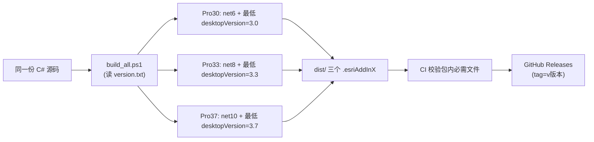

# CLAUDE.md

本文件为 GHBOX「规划盒子」ArcGIS Pro 加载项（Add-In）的开发方向指引。
供后续开发（新增/修改工具）时对齐架构、遵守铁律，避免跑偏。

## 项目定位

「规划盒子」是一套面向**国土空间规划数据库**的 ArcGIS Pro 批处理工具集：

- 发布形态：`.esriAddInX` 安装包（Ribbon 选项卡「规划盒子」），使用者双击即装，无路径/环境依赖。
- 开发形态：**纯 C#**（.NET），通过 `Escri.ArcGISPro.Extensions30` 官方 NuGet 包编译，**任何机器（不装 Pro）都能构建**。
- 分工：业务逻辑全部在 C#；`toolbox/` 下的 `.pyt` 是**业务逻辑留档基准**（与 C# 一一对应），AddIn 运行**不依赖**它们。

## 顶层结构

```
GHBOX/
├── CLAUDE.md                  # 本文档（开发方向指引）
├── AddIn开发指南.md            # 详细技术手册：结构、多版本兼容、成功经验、排查速查
├── RELEASE_NOTES.md           # 发布说明（工具清单 + 版本对照表）
├── version.txt                # ★ 版本号唯一来源（当前 1.0.2）
├── NuGet.config               # 清除机器级源，只留 nuget.org（保证 CI 与本机一致）
├── addin/                     # C# AddIn 工程（发布形态）
│   ├── GHBoxAddIn.csproj      # 按 BuildFlavor 切换目标框架/NuGet 版本
│   ├── Config.daml            # 功能区注册：选项卡 / 分组 / 按钮
│   ├── Module1.cs             # 模块入口单例
│   ├── build_all.ps1          # 一键构建三档 esriAddInX
│   ├── dist/                  # 构建产物（gitignore，分发的三个包）
│   ├── Images/                # 自绘 PNG 图标（FindHole/SearchArc/FindAngle/GHBox 16+32）
│   └── Scripts/
│       ├── GDB/               # 数据库处理工具（8 个）
│       │   ├── GpHelper.cs    # 公共辅助：执行 GP / Exists / GetCount / 打开 GDB
│       │   ├── Themes/GhBoxStyles.xaml  # 全工具统一样式字典
│       │   └── ShowXxx.cs + Xxx.xaml(.cs) + XxxHelp.xaml(.cs)  # 每工具三/四件套
│       └── Check/             # 数据库检查工具（3 个）
└── toolbox/                   # 原始 .pyt 留档（业务基准，非运行必需）
```

## 架构约定（改动前必读）

### 1. 版本号唯一来源：`version.txt`

- 构建、DLL 版本、`Config.daml` 的 `version`、CI 的 Release tag/名，**全部由 `version.txt` 派生**（脚本注入）。
- **开发时不要去手动改 `Config.daml` 里的 `version` / `desktopVersion`**：
  - `version="1.0.0"` 是源文件陈旧占位，`build_all.ps1` 会按标签内正则注入全局版本号；
  - `desktopVersion="3.6"` 打包时按档位替换为 3.0/3.3/3.7（Pro 依据它判断能否加载）。
- 发版流程：改 `version.txt` → push（或手动触发 CI）→ CI 自动构建三档并发布 GitHub Releases。

### 2. 多版本三档构建（一次出三个包）

| 安装包 | 目标框架 | NuGet | 适用 Pro |
|---|---|---|---|
| `GHBoxAddIn_Pro30.esriAddInX` | net6.0-windows | Extensions30 3.2.x | 3.0 ~ 3.2 |
| `GHBoxAddIn_Pro33.esriAddInX` | net8.0-windows | Extensions30 3.3.x | 3.3 ~ 3.6 |
| `GHBoxAddIn_Pro37.esriAddInX` | net10.0-windows | Extensions30 3.7.x | 3.7+ |



- NuGet 引用一律加 `ExcludeAssets="build;buildTransitive;runtime"`（Esri targets 在 dotnet CLI 下报 MSB4801；runtime 由 Pro 自带）。
- 构建必须带 `-p:CopyLocalLockFileAssemblies=true`，否则第三方依赖（ClosedXML）不复制进 bin、进不了包。
- **打包必须用 `[IO.Compression.ZipFile]::CreateFromDirectory`，禁用 `Compress-Archive`**（格式差异导致 Pro 拒绝解压）。

### 3. 三次需要同步的文件（改动一个工具时必须全改）

1. C# 实现（`addin/Scripts/分类/`）；
2. 对应 `.pyt` 留档（`toolbox/`，逻辑、参数、口径与 C# 一致）；
3. 三处「工具有哪些」的描述：`Config.daml` 的 controls/groups、`AddIn开发指南.md`（结构+业务约定）、`RELEASE_NOTES.md`（功能表）。

漏掉任何一个，都算「跑偏」。

## 工具开发铁律

- **绝不改写源数据**。所有中间结果写临时数据，唯一例外是「数据库比对」落差异结果到用户指定输出库、以及各工具在输出库落最终结果 —— 源图层永远只读。
- **临时数据命名**：`_tmp_` 前缀 + 本次运行标记（时间戳/标签），运行结束在 `finally` 中**自动清理**；先删残留再新建（防上次崩溃残留）。
- **输出图层命名**：结果统一按业务语义命名（如空洞结果 = `空洞_{图层名}`）；再跑覆盖旧结果。
- **面积一律椭球面积（测地线）**：C# 用 `GeometryEngine.GeodesicArea`（m²）；GP 用 `AddGeometryAttributes` 的 `AREA_GEODESIC`（任意坐标系下都按测地线算法算椭球面积 m²，字段名固定 `AREA_GEO`；**注意**：`POLY_AREA` 是输出字段名不是合法选项，选项值用 `AREA_GEODESIC`）；`.pyt` 用 `CalculateGeometryAttributes` 的 `AREA_GEODESIC`。小数舍入统一 `四舍五入`（C# `Math.Round(..., AwayFromZero)`，Python `decimal.ROUND_HALF_UP`，**禁用 Python 内建 `round``**）。
- **结果库可留空**：用户不指定输出库时，只做统计/日志，不落库（最终结果也清理）。
- **单库/单图层容错**：单图层失败记异常 → 继续下一个；但**启动级错误**（输入目录不存在、工作空间取不到、GpHelper 执行失败）直接失败。
- **交互风格与现有一致**：选库（`OpenItemDialog` `.gdb`）→ 多选图层（公共字段联动下拉）→ 参数 → 开始 → 进度条 + 日志区；统一用 `GhBoxStyles.xaml` 样式；窗口首行即第一个输入项，不放标题区（Title 已显示）。
- **C# 事件处理判空**：单位/小数位等默认值在 `Loaded` 里代码设置，不在 XAML 设；异步一律 `QueuedTask.Run` 内做，UI 控件回主线程更新。
- **新增字段/图层/参数** 前先想清楚：是否会被「数据库比对」「唯一编码」等通用工具撞上命名/口径冲突。

## 新增一个工具的标准清单（照此执行，避免跑偏）

```mermaid
flowchart TD
    A[1. 写 C#：ShowXxx + Xxx.xaml(.cs) + 帮助窗口] --> B[2. 业务逻辑复用 GpHelper / GhBoxStyles]
    B --> C[3. Config.daml 注册按钮 + 图标资源名实测]
    C --> D[4. 同步写 toolbox/Xxx.pyt 留档]
    D --> E[5. 更新 AddIn开发指南.md + RELEASE_NOTES.md]
    E --> F[6. build_all.ps1 三档构建 + 本机 Pro 验证]
    F --> G[7. 确认包内 Install/DLL + Images + 无硬编码路径]
    G --> H[8. 改 version.txt 并发版]
```

### 新增工具时的具体约束

- **图标资源名必须先实测再上 DAML**（空白按钮的血泪教训）：
  - 优先用 Pro 资源库提取的官方图标（`pack://application:,,,/ArcGIS.Desktop.Resources;component/Images/xxx.png`，名字必须确认存在，`GetManifestResourceNames` 看不到条目是正常的，图标在 `.g.resources` 容器流里）；
  - Pro 资源库没有合适语义时自绘 PNG（16/32）放 `addin/Images/`，csproj 加 `<Resource>` 嵌入，DAML 用 `pack://application:,,,/GHBoxAddIn;component/Images/xxx.png`；
  - 工具箱级图标（`<AddInInfo>` 的 `<Image>`）用包内**相对路径** `Images\GHBox32.png`，由 build_all.ps1 把 Images 目录复制进包根，缺这步「加载项」列表无图标。

#### 从 Pro SDK NuGet 缓存提取官方图标列表（无需安装 Pro）

Pro 的图标全部嵌入在 `ArcGIS.Desktop.Resources.dll` 的 `.g.resources` 容器流中。即使本机未安装 ArcGIS Pro，也能从 NuGet 缓存中提取。

**① DLL 位置**（NuGet 缓存）：

```
%USERPROFILE%\.nuget\packages\esri.arcgispro.extensions30\
  3.3.0.52636\ref\net8.0-windows7.0\ArcGIS.Desktop.Resources.dll   ← Pro 3.3+
  3.2.0.49743\ref\net6.0-windows7.0\ArcGIS.Desktop.Resources.dll   ← Pro 3.0+
```

版本号以实际安装的为准，目录结构固定。

**② 用 PowerShell 提取全部图标名**：

```powershell
$dllPath = "$env:USERPROFILE\.nuget\packages\esri.arcgispro.extensions30\3.3.0.52636\ref\net8.0-windows7.0\ArcGIS.Desktop.Resources.dll"
$asm = [System.Reflection.Assembly]::LoadFrom($dllPath)
$stream = $asm.GetManifestResourceStream("ArcGIS.Desktop.Resources.g.resources")
$reader = New-Object System.Resources.ResourceReader($stream)
$keys = @()
$e = $reader.GetEnumerator()
while ($e.MoveNext()) { $keys += $e.Key }
$stream.Dispose()

# 按关键词搜索（如 edit / sync / update / merge / tool / data / refresh）
$keys | Where-Object { $_ -match "images/edit" -and $_ -match "(16|32)\.png$" } | Sort-Object
```

资源命名规则：`images/{图标名}{尺寸}.png`，全部小写，总计约 18000+ 条目。

**③ DAML 引用格式**：

```xml
smallImage="pack://application:,,,/ArcGIS.Desktop.Resources;component/Images/{图标名}16.png"
largeImage="pack://application:,,,/ArcGIS.Desktop.Resources;component/Images/{图标名}32.png"
```

> **注意**：资源名在 DLL 内全小写，但 WPF 资源加载在 Windows 上**不区分大小写**，所以 DAML 中用驼峰或小写均可。推荐直接用 DLL 中的原始小写名避免混淆。

**④ 已验证可用的图标名速查**（动态维护相关）：

| 图标名 | 语义 |
|--------|------|
| `genericsync` | 通用同步/维护（当前动态维护使用） |
| `geoprocessingtool` | GP 工具箱 |
| `geoprocessingtool_merge_management` | 合并工具 |
| `geodatabase` | 数据库 |
| `geodatabasebeingedited` | 正在编辑的数据库 |
| `updatesubnetworks` | 更新子网络 |
- **`.pyt` 留档口径**：允许与 C# 有实现细节差异，但**结论口径必须一致**，并在注释中注明差异与粒度以谁为准。
  - 例：「查找弧线段」arcpy 拿不到段级类型，用 `SHAPE@JSON` 含 `"curve"` 键整体导出，C# 才能逐段拆分 → 结论一致、粒度以 C# 为准。
- **不得在正式工具箱目录留调试脚本**：一次性诊断脚本（`_diag_*.py`）用完即删，禁止带硬编码测试路径（如 `c:\Users\...\测试数据\`）入库。已清过一次（2026-08 删除 4 个），后续再犯视为跑偏。

## 已知检查结论（2026-08 盘点）

| 项 | 状态 | 说明 |
|---|---|---|
| `toolbox/_diag_findhole.py`、`_diag_ring.py`、`_diag_ring2.py`、`_diag_ring3.py` | 已删除 | 历史空洞调试脚本，硬编码测试路径，属多余文件 |
| `Config.daml` 的 `version="1.0.0"` | 属正常 | 源文件陈旧占位，打包时由 build_all.ps1 注入 `version.txt` 全局版本号，**勿手改** |
| `Config.daml` 的 `desktopVersion="3.6"` | 属正常 | 打包时按档位替换为 3.0/3.3/3.7，**勿手改** |
| C# 与 `.pyt` 一一对应 | 正常 | 数据库处理 8 工具 + 数据库检查 3 工具全部对应 |

## 检查出「多余 / 错误」后的处理习惯

- 用户要求「检查多余/错误」时，先做三件事：① Grep `_diag`/`测试数据`/硬编码绝对路径；② 核对 `Config.daml` 按钮 ↔ C# ShowXxx 类 ↔ `.pyt` 工具类三向对应；③ 核对版本号三处（`version.txt` ↔ csproj ↔ Config.daml 注入结果）。
- 发现多余文件先向用户确认再删，不擅自动手。
- 排查引用：开发指南看 `AddIn开发指南.md`；工具口径看对应 `.pyt`；运行期日志看 Pro 诊断文件（`Documents\ArcGIS\Diagnostics\ArcGISProLog-*.xml`，会话结束才落盘）与 `%LOCALAPPDATA%\ESRI\ArcGISPro\AssemblyCache\`。